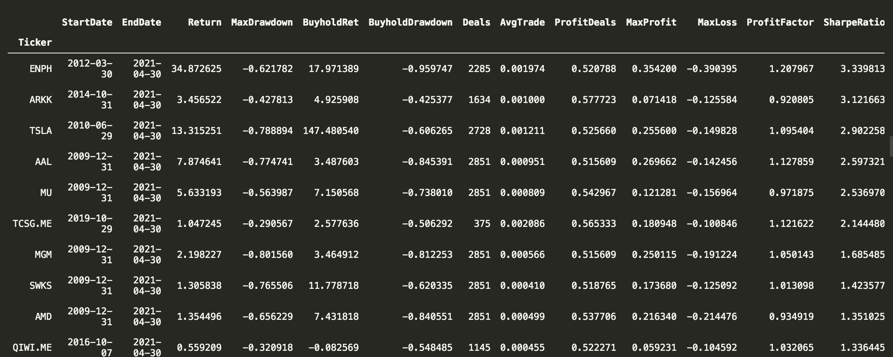
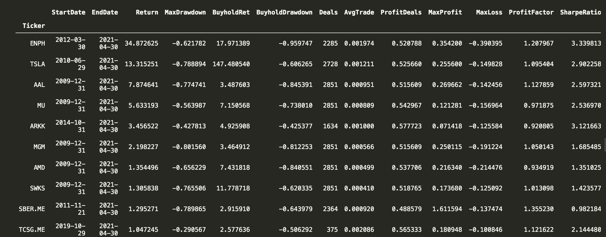
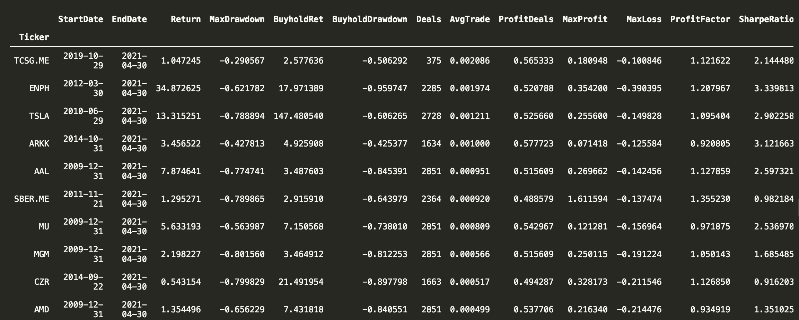
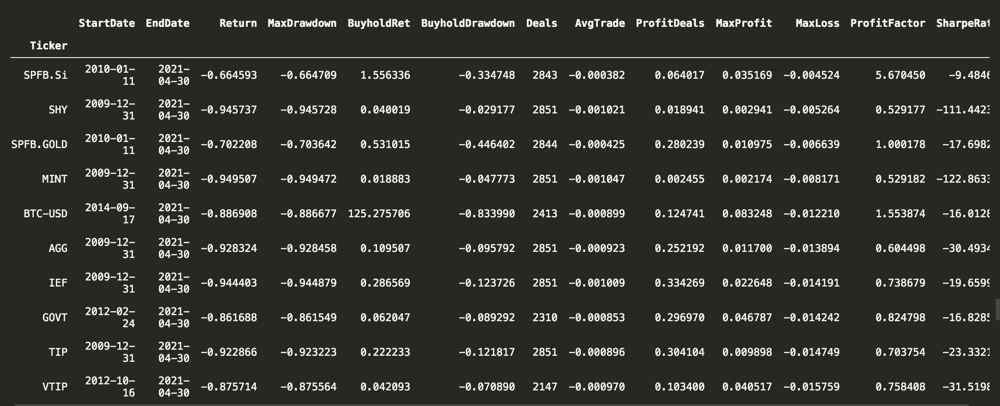
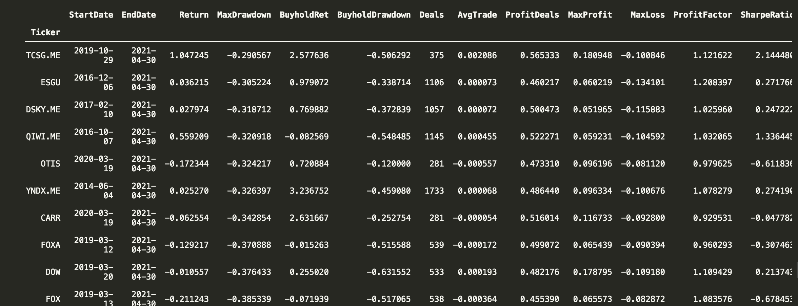
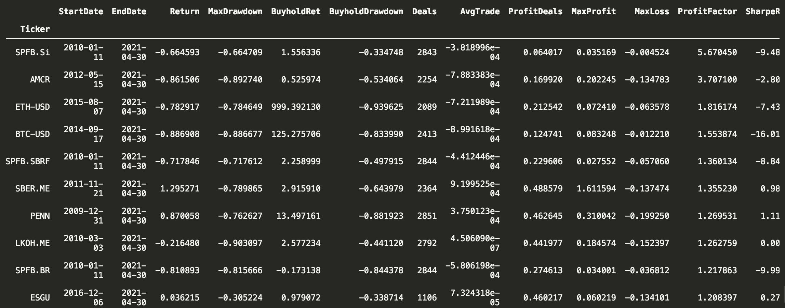

Мне всегда хотелось постетировать торговую стратегию на большом количестве инструментов. Навести научность на всё это бектестирование. Наконец руки дошли написать свой универсальный недотестер.

Раньше я уже писал про стратегию [покупки на закрытии и продажи на открытии](https://zenoftrading.github.io/buy-the-close-sell-the-open.html) Её и выбрал для пробного полёта. 

Суть страетегии очень проста. Каждый день покупаем на закрытии, продаём на следующем открытии. Нужно было взять что-то простое для теста. 

Всего собрал 650 тикеров:
- индекс IMOEX в полном составе
- наиболее ликвидные фьючерсы на мосбирже (нам же нужно, чтобы миллионы торговались без проскальзываний): рубль/доллар, индекс РТС, нефть, золото, сбербанк
- индекс SP500 в полном составе
- 100 наиболее ликвидных ETF
- валютные пары: rub, eur и gbp с долларом
- крипта, куда ж без неё: btc и eth с usdt

Для всего, кроме фьючерсов взял комиссию 0.05%, для фьючерсов 0.03%. Какой же бектестер без комиссий.

Стартовой датой выбрал 1 января 2010 года. Если тестировать, то точно больше 10 лет. Не всё тогда ещё было, но тем не менее.

Написал на питоне пару сотен строчек кода. Запустил... и компьютер переваривал всё это часов 8. Натужно гудел кулером, записывал логи, аккуратно складывал файлики с результатами. Да уж, питон не самый быстрый язык программирования.

## Статистика
Что будем смотреть? Доходность конечно. Не забудем про Шарпа. Сравним с бай энд холд и посмотрим на просадки. Ну и посмотрим что там по группам.

На всякий случай опишу параметры:
- Return: доходность
- MaxDrawdown: максимальная просадка
- BuyholdRet: доходность стратегии купи и держи
- BuyholdDrawdown: максимальная просадка стратегии купи и держи
- Deals: количество сделок
- AvgTrade: средняя сделка
- ProfitDeals: количество прибыльных сделок, для процентов нужно умножить на 100
- MaxProfit: максимальный доход в одной сделке
- MaxLoss: максимальный убыток в одной сделке
- ProfitFactor: профит фактор
- SharpeRatio: коэффициент шарпа

### Лучшая десятка по шарпу

<br/>
Вроде шарп хороший. Но опять же, если сравнить с купи и держи, то уже не очень. Выделяется ENPH.

Средние показатели лучшей десятки:
```
Return                7.161725
MaxDrawdown          -0.601200
BuyholdRet           20.618652
BuyholdDrawdown      -0.690271
Deals              2242.200000
AvgTrade              0.000996
ProfitDeals           0.534243
MaxProfit             0.195247
MaxLoss              -0.170146
ProfitFactor          1.047576
SharpeRatio           2.243904
```
Сравнения не в пользу трейдинга.

А если взять худший вариант:
```
Return               -0.932173
MaxDrawdown          -0.932235
BuyholdRet            0.064630
BuyholdDrawdown      -0.086667
Deals              2780.600000
AvgTrade             -0.000980
ProfitDeals           0.123248
MaxProfit             0.018106
MaxLoss              -0.023815
ProfitFactor          0.633989
SharpeRatio         -51.646703
```
В трейдинге останется 7% от депозита, при купи и держи хотябы останитесь при своих.

### Лучшая десятка по доходности

<br/>
Те же, что и с Шарпом. Подтянулась парочка российских банков. Что примечательно, тиньков с конца 2019 показал такую же доходность, как остальные за 10 лет.

Средние данные по худшей десятке:
```
Return               -0.985327
MaxDrawdown          -0.986891
BuyholdRet            1.624872
BuyholdDrawdown      -0.583964
Deals              2839.200000
AvgTrade             -0.001564
ProfitDeals           0.417349
MaxProfit             0.108455
MaxLoss              -0.199081
ProfitFactor          0.821783
SharpeRatio          -7.019729
```
С тредингом почти в ноль, купи и держи +162%


### Лучшая десятка по средней сделке

<br/>

Тут снова лидирует тиньков. Есть ещё ENPH и AAL у которых доходность от трейдинга выше доходности купи и держи.


### Минимальный гэп

<br/>

Тут из примечательного, что ни одной положительной доходности.

### Минимальная просадка

<br/>

Интересно, что почти половина компаний это российский рынок

### Максимальный профит фактор

<br/>

## И что?

- Купи и держи в среднем выигрывает
- Всего в тесте почти 1,8 млн сделок (реально их два раза больше, так как нужно купить и продать), брокер и биржа тоже в выигрыше

Давайте ещё по средним значениям пройдёмся по всем сделкам:
```
Return               -0.656126
MaxDrawdown          -0.873294
BuyholdRet            6.197939
BuyholdDrawdown      -0.499225
Deals              2711.976852
AvgTrade             -0.000627
ProfitDeals           0.440754
MaxProfit             0.113519
MaxLoss              -0.135855
ProfitFactor          0.965702
SharpeRatio          -4.680868
```

Для пробного запуска, думаю отлично. Не переключайтесь. Дальше рассмотрим что-нибудь посложнее.

Если сами хотите поиграться, полный файл со стаистикой в телеграме https://bit.ly/zenoftrading