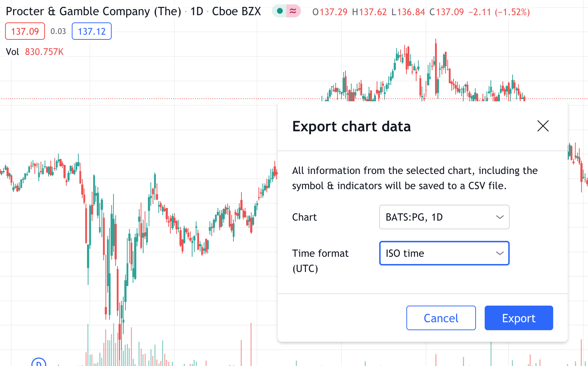
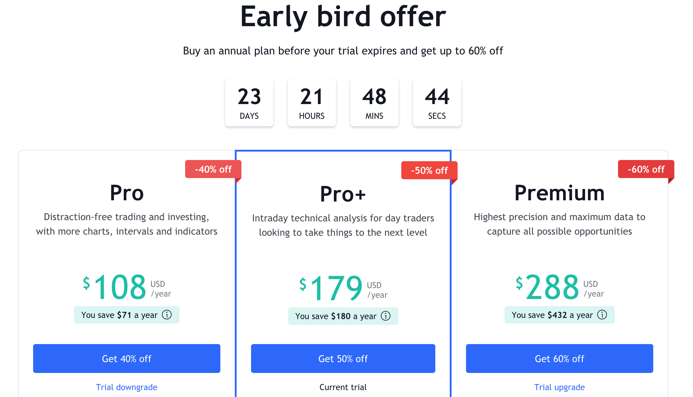

Искал откуда можно скачать исторические котировки. Да так, чтобы все было в одном месте: и рынок РФ, и рынок США, и фьючерсы, и крипта. Да ещё и бесплатно. 

Все эти котировки есть в tradingview, но скачать оттуда можно только в платном аккаунте.

 

Кстати, при регистрации дают пробный период на 30 дней на любом тарифе. Во время пробного периода можно купить платный аккаунт со скидкой до 60%.

 

Но пробный период закончится через 30 дней, а котировки скачивать нужно будет. Да и не скачивать же каждый раз всё руками. Питон для чего придумали.

На гитхабе нашёл прекрасную библиотеку какого-то индийца [https://github.com/StreamAlpha/tvdatafeed](https://github.com/StreamAlpha/tvdatafeed) Она через селениум качает исторические данные в датафрейм, который потом можно сохранить в файл или сразу использовать в работе. 

Для скачивания достаточно бесплатного аккаунта на tradingview или даже вообще можно обойтись без аккаунта. Качать можно до 5000 баров на любом доступном таймфрейме. 

На видео можно посмотреть как это всё работает [https://www.youtube.com/watch?v=qDrXmb2ZRjo](https://www.youtube.com/watch?v=qDrXmb2ZRjo)

Если что нужно скачать, обращайтесь.

Несколько примеров использования посмотреть у меня в телеграме: [https://bit.ly/zenoftrading](https://bit.ly/zenoftrading)